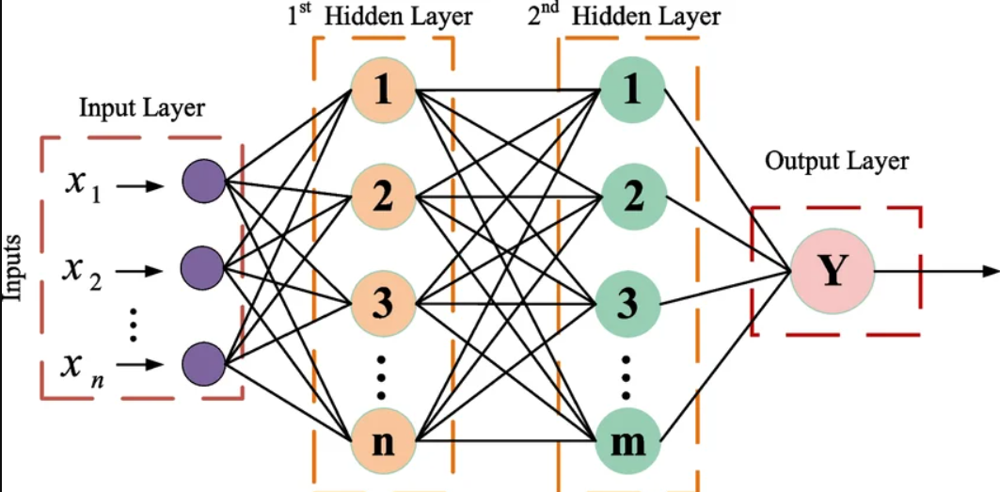
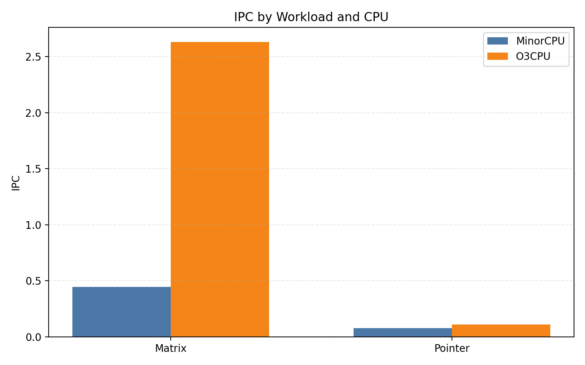

# Comparative gem5 Study of In-Order and Out-of-Order CPU Models

This repository contains a coursework project for my **High Performance Computing Systems** university course focused on a comparative simulation study between **`MinorCPU`** (in-order) and **`O3CPU`** (out-of-order) using **gem5**.

The project evaluates how the processor model affects performance for two contrasting workloads:

- **Matrix multiplication** as a compute-bound benchmark
- **Pointer chasing** as a memory-bound benchmark

The repository includes the benchmark source code, gem5 configuration scripts, experiment automation, result extraction utilities, and the final LaTeX report.

## Motivation

Matrix multiplication is a core building block in numerical computing and modern AI systems. Fully connected neural network layers are ultimately expressed through matrix operations, which makes matrix-heavy workloads a useful proxy for studying how a microarchitecture behaves on practical compute-intensive tasks.

<p align="center">
  
</p>

## Project Goals

The objective of the study is to compare two CPU microarchitectural models under identical system conditions and isolate the effect of instruction scheduling:

- same ISA: **X86**
- same clock frequency
- same cache hierarchy
- same memory configuration
- same benchmark inputs
- only the CPU model changes: **`MinorCPU`** vs **`O3CPU`**

This setup allows the observed differences in IPC, CPI, cycles, and cache behavior to be interpreted as a direct consequence of the underlying execution model.

## Repository Structure

```text
CourseWork/
├── benchmarks/
│   ├── build.sh
│   └── src/
│       ├── matrix_multiply.c
│       └── pointer_chase.c
├── configs/
│   └── run_se.py
├── extract_stats.py
├── generate_report_assets.py
├── report/
│   ├── build/
│   │   └── main.pdf
│   ├── build_report.sh
│   ├── figures/
│   └── main.tex
├── results/
│   └── summary.csv
└── run_experiments.sh
```

## What Is Intentionally Not Included

This repository does **not** vendor the full `gem5` source tree. The local project setup used a separate clone of the official gem5 repository under `CourseWork/gem5`, but that directory is excluded from version control because it is large, external, and independently maintained.

If you want to reproduce the experiments exactly as in this project, clone gem5 into the repository root as:

```bash
git clone https://github.com/gem5/gem5.git
```

## Environment

The project was developed on Linux with a Conda environment using **Python 3.12** and **SCons**.

Example:

```bash
conda create -n gem5-hpcs python=3.12 scons
conda activate gem5-hpcs
```

Install the native dependencies required by gem5 according to the official documentation:

- gem5 build docs: https://www.gem5.org/documentation/general_docs/building

## Building gem5

The project uses the optimized X86 build:

```bash
conda activate gem5-hpcs
cd gem5
PYTHON_CONFIG="$CONDA_PREFIX/bin/python3.12-config" \
PATH="$CONDA_PREFIX/bin:$PATH" \
scons build/X86/gem5.opt -j4
```

The explicit `PYTHON_CONFIG` export is important on systems where another global `python3-config` shadows the Conda one.

## Building the Benchmarks

```bash
cd benchmarks
./build.sh
```

This produces:

- `benchmarks/bin/matrix_multiply`
- `benchmarks/bin/pointer_chase`

## Running the Experiments

From the repository root:

```bash
conda activate gem5-hpcs
./run_experiments.sh
```

The script runs four simulations:

1. `matrix_minor`
2. `matrix_o3`
3. `pointer_minor`
4. `pointer_o3`

Each run produces gem5 statistics in `results/<case>/`.

## Extracting the Summary CSV

```bash
python3 extract_stats.py --results-dir results
```

This writes:

- `results/summary.csv`

## Rebuilding the Report

The report is written in LaTeX and built into `report/build`.

```bash
cd report
./build_report.sh
```

Final report artifact:

- `report/build/main.pdf`

## Main Results

The final experiment summary is stored in `results/summary.csv`. The key observations are:

- For **matrix multiplication**, `O3CPU` achieves about **5.91x higher IPC** than `MinorCPU`.
- For **pointer chasing**, `O3CPU` still performs better, but the gain is much smaller at about **1.42x IPC**.
- This matches the expected behavior: out-of-order execution is most effective when the workload exposes enough ILP and is less effective when execution is dominated by memory latency.

<p align="center">
  
</p>

Summary table:

| Workload | CPU | Sim Insts | Cycles | IPC | CPI | L1D Miss Rate | L2 Miss Rate |
| --- | --- | ---: | ---: | ---: | ---: | ---: | ---: |
| Matrix | Minor | 29.08 M | 65.32 M | 0.445 | 2.246 | 0.000869 | 0.015299 |
| Matrix | O3 | 29.08 M | 11.05 M | 2.631 | 0.380 | 0.003427 | 0.015169 |
| Pointer | Minor | 12.43 M | 159.69 M | 0.078 | 12.845 | 0.357979 | 0.463546 |
| Pointer | O3 | 12.43 M | 112.25 M | 0.111 | 9.030 | 0.372311 | 0.477100 |

## Report Highlights

The final report includes:

- theoretical background on in-order vs out-of-order execution
- relation between matrix multiplication and neural networks
- methodology and system configuration
- benchmark code excerpts
- raw and derived result tables
- compact comparative plots
- final conclusions and limitations

## References

- gem5 documentation: https://www.gem5.org/documentation/
- Hennessy & Patterson, *Computer Architecture: A Quantitative Approach*
